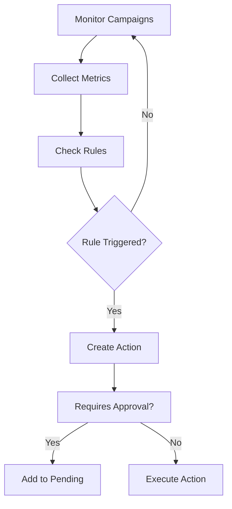
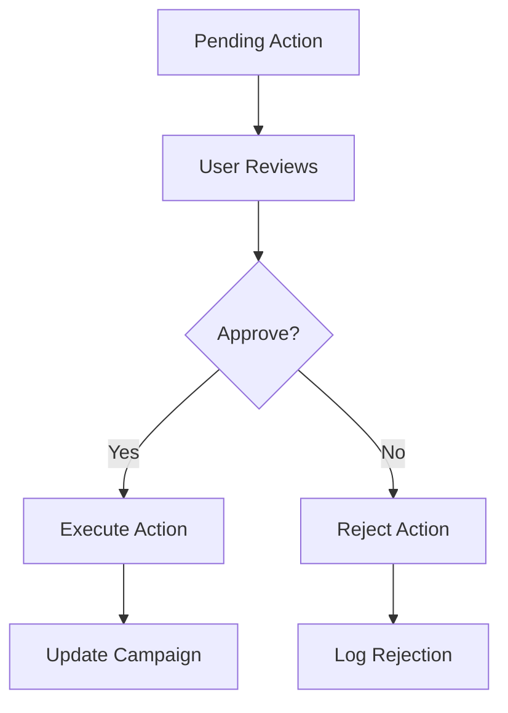
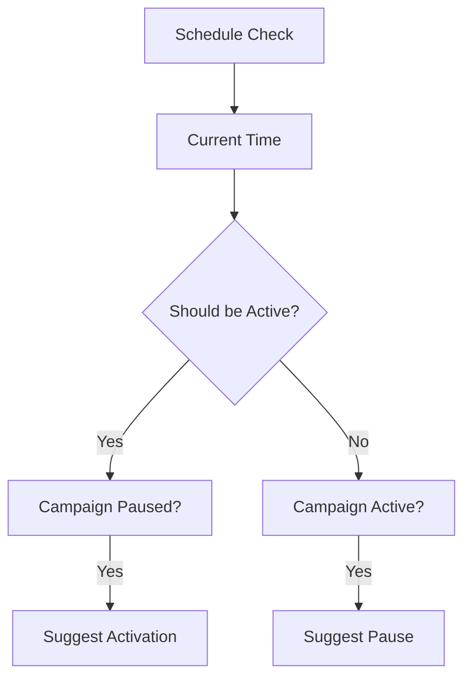

# 🤖 Sistema de Automação de Campanhas - Mercado Livre

## 📋 Visão Geral

Este sistema implementa uma solução completa de automação de campanhas publicitárias para o Mercado Livre, utilizando Inteligência Artificial e Machine Learning para otimização automática baseada em métricas e comportamento de concorrência.

## 🎯 Funcionalidades Implementadas

### ✅ Ativação e Pausa Inteligente de Campanhas
- **Monitoramento de Métricas**: ACOS, TACOS, margem mínima, CPC, CTR, taxa de conversão
- **Regras Automáticas**: Definição de thresholds personalizados por campanha
- **Ações Inteligentes**: Pause, ativação e ajuste de lances baseados em performance
- **Sistema de Confiança**: Score de confiança para cada ação sugerida

### ✅ Otimização Temporal
- **Análise de Períodos**: Monitoramento de conversões em janelas de 15 dias
- **Calendário Interativo**: Configuração visual de horários de ativação por dia da semana
- **Agendamento Automático**: Ativação/pausa baseada em horários programados
- **Análise de Sazonalidade**: Identificação de padrões temporais de performance

### ✅ Monitoramento de Concorrência
- **Top 20 Anúncios**: Monitoramento dos principais concorrentes por categoria
- **Análise de Posicionamento**: Tracking de posições e estratégias competitivas
- **Otimização de Keywords**: Ajustes baseados na análise da concorrência
- **Alertas de Mudanças**: Notificações sobre alterações no cenário competitivo

### ✅ Previsão de ACOS Pré-Ativação
- **Machine Learning**: Algoritmos preditivos baseados em dados históricos
- **Intervalos de Confiança**: Estimativas com margem de erro
- **Fatores de Influência**: Identificação dos principais drivers de performance
- **Recomendações**: Sugestões automáticas baseadas nas previsões

### ✅ Sistema de Aprovação de Usuário
- **Workflow de Aprovação**: Todas as ações críticas requerem aprovação manual
- **Interface Intuitiva**: Dashboard para aprovar/rejeitar ações sugeridas
- **Justificativas**: Explicações detalhadas para cada ação sugerida
- **Histórico de Decisões**: Log completo de aprovações e rejeições

### ✅ Dashboard Completo
- **Métricas em Tempo Real**: Visão geral das campanhas e performance
- **Gráficos Interativos**: Visualizações com Plotly para análise detalhada
- **Comparativos**: Análise de evolução e benchmarking
- **Alertas Visuais**: Indicadores de status e ações pendentes

### ✅ Sistema de Aprendizado Contínuo
- **Integração com Learning Service**: Utiliza o serviço existente de aprendizado
- **Feedback Loop**: Sistema de feedback para melhorar sugestões
- **Otimização Automática**: Ajustes contínuos baseados em resultados
- **Versionamento de Modelos**: Controle de versões dos algoritmos de predição

## 🏗️ Arquitetura Técnica

### 🔧 Tecnologias Utilizadas
- **Backend**: FastAPI com Python 3.11
- **Frontend**: React.js com componentes customizados
- **Banco de Dados**: PostgreSQL para persistência
- **Cache**: Redis para dados temporários
- **Agendamento**: APScheduler para tarefas automáticas
- **ML**: Scikit-learn e Pandas para predições
- **Visualização**: Plotly.js para gráficos interativos

### 🏭 Serviços Integrados
- **Simulator Service** (porta 8001): Simulação de campanhas
- **Learning Service** (porta 8002): Aprendizado contínuo
- **Optimizer AI** (porta 8003): Otimização de copywriting
- **Campaign Automation** (porta 8014): **NOVO** - Automação de campanhas

### 📊 Modelos de Dados

#### CampaignRule
```python
{
    "rule_id": "RULE_001",
    "campaign_id": "CAMP_001", 
    "metric_type": "acos",      # acos, tacos, margin, cpc, ctr, conversion_rate
    "threshold_value": 0.25,
    "action_type": "pause",     # activate, pause, adjust_bid, optimize_keywords
    "is_active": true
}
```

#### CampaignMetrics
```python
{
    "campaign_id": "CAMP_001",
    "acos": 0.22,
    "tacos": 0.18,
    "margin": 20.5,
    "cpc": 1.50,
    "ctr": 0.045,
    "conversion_rate": 0.032,
    "impressions": 10000,
    "clicks": 450,
    "conversions": 15,
    "spend": 675.0,
    "revenue": 3000.0
}
```

#### AutomationAction
```python
{
    "action_id": "rule_RULE_001_timestamp",
    "campaign_id": "CAMP_001",
    "action_type": "pause",
    "reason": "ACOS 0.3 triggered rule threshold 0.25",
    "suggested_values": {"status": "paused"},
    "confidence_score": 0.74,
    "requires_approval": true,
    "status": "pending"
}
```

## 🚀 APIs Implementadas

### 📈 Endpoints de Campanhas
- `GET /api/campaigns` - Lista todas as campanhas
- `GET /api/campaigns/{id}` - Detalhes de uma campanha específica
- `POST /api/campaigns/{id}/rules` - Criar regra de automação
- `POST /api/campaigns/{id}/schedule` - Criar agendamento

### 📊 Endpoints de Monitoramento
- `GET /api/monitoring/metrics/{id}` - Métricas da campanha
- `GET /api/monitoring/competitors` - Análise de concorrência
- `POST /api/monitoring/update-metrics` - Atualizar métricas

### 🔮 Endpoints de Predições
- `GET /api/predictions/acos/{id}` - Previsão de ACOS

### ✅ Endpoints de Aprovações
- `GET /api/approvals/pending` - Ações pendentes
- `POST /api/approvals/{id}/approve` - Aprovar ação
- `POST /api/approvals/{id}/reject` - Rejeitar ação

### 📊 Endpoints de Dashboard
- `GET /api/dashboard/overview` - Visão geral
- `GET /api/dashboard/charts/{id}` - Gráficos da campanha

### 📅 Endpoints de Calendário
- `GET /api/calendar/{id}` - Calendário da campanha
- `POST /api/calendar/{id}/events` - Criar evento

## 🔄 Fluxo de Automação

### 1. Monitoramento Contínuo


### 2. Sistema de Aprovação


### 3. Otimização Temporal


## 🎨 Interface de Usuário

### 📊 Dashboard Principal
- **Cards de Métricas**: Total de campanhas, campanhas ativas, aprovações pendentes, ACOS médio
- **Tabs de Navegação**: Campanhas, Aprovações, Calendário, Analytics
- **Visualizações**: Gráficos de performance e métricas financeiras
- **Ações Rápidas**: Aprovação/rejeição com um clique

### 📅 Calendário Interativo
- **Visualização Semanal**: Grid de dias da semana
- **Configuração de Horários**: Interface para definir horários de ativação
- **Eventos Visuais**: Indicadores coloridos para campanhas ativas/pausadas
- **Integração com Regras**: Conexão direta com sistema de automação

## 🧪 Recursos Adicionais

### 🎯 Integração com Descontos
- **Pause Inteligente**: Aplicação automática de descontos ao pausar campanhas
- **Minimização de Perdas**: Estratégias para manter vendas durante pausas
- **Análise de Impacto**: Medição do efeito dos descontos na performance

### 🏆 Otimização de Keywords
- **Análise Competitiva**: Ajustes baseados na concorrência
- **Sugestões Automáticas**: IA para recomendar novas palavras-chave
- **Performance Tracking**: Monitoramento de performance por keyword

### 📈 Aprendizado Contínuo
- **Feedback de Performance**: Sistema para capturar resultados das ações
- **Melhoria de Algoritmos**: Refinamento contínuo dos modelos de predição
- **Adaptação Automática**: Ajuste de thresholds baseado em histórico

## 🚀 Como Usar

### 1. Configuração de Regras
```bash
# Criar regra de ACOS
curl -X POST http://localhost:8014/api/campaigns/CAMP_001/rules \
  -H "Content-Type: application/json" \
  -d '{
    "rule_id": "RULE_ACOS_001",
    "metric_type": "acos",
    "threshold_value": 0.25,
    "action_type": "pause"
  }'
```

### 2. Agendamento de Campanha
```bash
# Configurar horário de ativação
curl -X POST http://localhost:8014/api/campaigns/CAMP_001/schedule \
  -H "Content-Type: application/json" \
  -d '{
    "schedule_id": "SCHED_001",
    "day_of_week": 1,
    "start_hour": 8,
    "end_hour": 22
  }'
```

### 3. Atualização de Métricas
```bash
# Enviar métricas da campanha
curl -X POST http://localhost:8014/api/monitoring/update-metrics \
  -H "Content-Type: application/json" \
  -d '{
    "campaign_id": "CAMP_001",
    "acos": 0.30,
    "margin": 12.0,
    "spend": 1000.0,
    "revenue": 3000.0
  }'
```

### 4. Aprovação de Ações
```bash
# Aprovar ação pendente
curl -X POST http://localhost:8014/api/approvals/ACTION_001/approve
```

## 📊 Exemplos de Uso

### Cenário 1: ACOS Alto
1. **Trigger**: ACOS de 0.30 ultrapassa threshold de 0.25
2. **Ação**: Sistema sugere pausar campanha
3. **Aprovação**: Usuário aprova a ação
4. **Execução**: Campanha é pausada e desconto é aplicado
5. **Resultado**: Economia de budget e manutenção de vendas

### Cenário 2: Otimização Temporal
1. **Análise**: Sistema identifica baixa performance após 20h
2. **Configuração**: Usuário agenda pausa automática às 20h
3. **Execução**: Campanha é pausada automaticamente todos os dias
4. **Resultado**: Melhor ROI com foco em horários de alta conversão

### Cenário 3: Concorrência
1. **Monitoramento**: Sistema detecta novo concorrente agressivo
2. **Análise**: Identificação de keywords sendo disputadas
3. **Sugestão**: Ajuste de lances para manter posicionamento
4. **Aprovação**: Usuário aprova ajuste de 15% nos lances
5. **Resultado**: Manutenção da competitividade

## 🔍 Logs e Monitoramento

### Logs Detalhados
- **Ações Executadas**: Log completo de todas as automações
- **Decisões de Usuário**: Histórico de aprovações e rejeições
- **Performance de Predições**: Acurácia dos modelos de ML
- **Saúde do Sistema**: Status dos componentes e serviços

### Métricas de Sistema
- **Latência**: Tempo de resposta das APIs
- **Throughput**: Número de campanhas monitoradas
- **Acurácia**: Precisão das predições de ACOS
- **Uptime**: Disponibilidade do serviço

## 🛡️ Segurança e Confiabilidade

### Validações
- **Threshold Limits**: Validação de limites seguros para thresholds
- **Budget Protection**: Proteção contra gastos excessivos
- **Rate Limiting**: Limitação de frequência de ações
- **Rollback**: Capacidade de reverter ações automáticas

### Backup e Recuperação
- **Dados de Configuração**: Backup automático de regras e schedules
- **Histórico de Ações**: Preservação de logs de decisões
- **Estado de Campanhas**: Snapshot regular do estado das campanhas

## 🚀 Deployment

O sistema está configurado para deployment via Docker:

```bash
# Subir apenas o serviço de automação
docker compose up campaign_automation

# Subir stack completa
docker compose up
```

**Portas dos Serviços:**
- Campaign Automation: http://localhost:8014
- Frontend: http://localhost:3000
- Backend: http://localhost:8000

## 🎯 Próximos Passos

### Melhorias Futuras
1. **Machine Learning Avançado**: Implementação de redes neurais para predições
2. **Análise de Sentimento**: Monitoramento de reviews e comentários
3. **Integração Mercado Livre**: Conexão direta com APIs oficiais
4. **Mobile App**: Aplicativo para monitoramento móvel
5. **A/B Testing**: Framework para testes automatizados de estratégias

### Escalabilidade
1. **Microserviços**: Decomposição em serviços menores
2. **Kubernetes**: Migration para orquestração cloud-native
3. **Multi-tenant**: Suporte a múltiplos clientes
4. **Real-time**: Processamento em tempo real com Apache Kafka

---

## ✨ Conclusão

Este sistema de automação de campanhas representa uma solução completa e inovadora para otimização de campanhas publicitárias no Mercado Livre. Com inteligência artificial, machine learning e uma interface intuitiva, oferece automação inteligente mantendo o controle humano nas decisões críticas.

A implementação modular e bem documentada permite fácil manutenção e extensão, enquanto a integração com os serviços existentes maximiza o aproveitamento da infraestrutura já desenvolvida.

**Resultado:** Um sistema robusto, escalável e eficaz para maximizar o ROI das campanhas publicitárias com mínima intervenção manual.