# 🧠 Visão Geral do Projeto `ml_project`

Este projeto integra **FastAPI** (backend) e **React** (frontend) com a API do Mercado Libre, utilizando **Docker Compose** para orquestrar os serviços: backend, frontend, PostgreSQL e pgAdmin.

---

## 📦 Componentes do Projeto

### Backend (`/backend`)
- **FastAPI** com autenticação OAuth2
- **SQLAlchemy + Alembic** para ORM e migrações
- **Loguru** para logs estruturados
- **Pytest** para testes automatizados
- **Dockerfile** para build do serviço

### Frontend (`/frontend`)
- SPA com **React**
- Integração com backend via token OAuth
- Interface de login e visualização de dados

### Infraestrutura
- **Docker Compose** para orquestração
- **PostgreSQL** como banco de dados
- **pgAdmin** como interface de administração

---

## 🔐 Autenticação com Mercado Libre

Fluxo OAuth2 implementado:

1. Usuário acessa `/api/oauth/login`
2. Redirecionado para login no Mercado Libre
3. Após autenticação, retorna para `/api/oauth/callback`
4. Backend salva o token de acesso

> É necessário registrar a aplicação no [Mercado Libre Developers](https://developers.mercadolibre.com.ar/) e configurar a Redirect URI como `http://localhost:8000/api/oauth/callback`.

---

## 🧪 Testes

- Testes unitários com Pytest
- Cobrem rotas, serviços e modelos
- Comando:
  ```bash
  cd backend
  pytest -q
  ```

---

## ⚙️ Migrações com Alembic

- Criar migração:
  ```bash
  alembic revision --autogenerate -m "descrição"
  ```
- Aplicar migração:
  ```bash
  alembic upgrade head
  ```

---

## 📈 Diagrama de Arquitetura (Texto)

```
[Usuário]
   ↓
[Frontend React]
   ↓
[Backend FastAPI]
   ├── /api/oauth/login
   ├── /api/oauth/callback
   ├── /products
   ↓
[Serviço Mercado Libre API]
   ↓
[PostgreSQL + Alembic]
   ↓
[pgAdmin]
```

---

## 📎 Variáveis de Ambiente

Exemplo de `.env.example`:

```env
DATABASE_URL=postgresql+psycopg2://postgres:postgres@db:5432/ml_db
SECRET_KEY=your_secret_key
ML_CLIENT_ID=your_client_id
ML_CLIENT_SECRET=your_client_secret
ML_REDIRECT_URI=http://localhost:8000/api/oauth/callback
```

---

## ✅ Status Atual

- Backend funcional com autenticação Mercado Libre
- Frontend integrado
- Banco de dados com Alembic
- Docker Compose com PostgreSQL e pgAdmin
- Testes unitários
- Documentação básica clara

---

## 🧪 Testes

### Configuração para Testes Automatizados

Todos os testes devem usar a string de conexão padronizada para garantir compatibilidade com Docker Compose:

```bash
# Variável de ambiente para testes
export DATABASE_URL=postgresql+psycopg2://postgres:postgres@db:5432/ml_db

# Executar testes em ambiente Docker
docker-compose exec backend pytest -v

# Testes com coverage
docker-compose exec backend pytest --cov=app --cov-report=html
```

**Importante**: O host 'db' é usado no contexto de containers Docker. Para desenvolvimento local, substitua 'db' por 'localhost' se necessário.

---

## 🚀 Sugestões de Melhoria

- [ ] Armazenamento seguro de tokens (criptografia ou banco seguro)
- [ ] Documentação Swagger expandida
- [ ] Monitoramento com Prometheus/Grafana
- [ ] Rate limiting com `slowapi`
- [ ] Testes de integração com banco e autenticação
- [ ] CI/CD para produção com GitHub Actions

---

## 📬 Contato

Desenvolvido por **Aluizio Renato** — sugestões e contribuições são bem-vindas!
```
Com base no conteúdo completo do repositório [`ml_project`](https://github.com/aluiziorenato/ml_project/tree/main), aqui está um fluxograma visual detalhado que representa a arquitetura e o fluxo de dados da aplicação:

---

## 📊 Fluxograma Visual da Arquitetura

```mermaid
graph TD
  A[Usuário] --> B[Frontend React]
  B --> C[Backend FastAPI]
  C --> D[Rotas da API]
  D --> E[Serviço OAuth2 Mercado Libre]
  C --> F[Banco de Dados PostgreSQL]
  F --> G[pgAdmin]
  C --> H[Documentação Swagger]
  C --> I[Testes com Pytest]
  C --> J[Logs com Loguru]
  C --> K[Migrações com Alembic]

  subgraph Infraestrutura
    C
    F
    G
  end

  subgraph Desenvolvimento
    H
    I
    J
    K
  end
```



---

## 🧠 Explicação do Fluxograma

- **Usuário** interage com a interface React.
- O **Frontend** envia requisições para o **Backend FastAPI**.
- O Backend possui rotas organizadas em `/api`, incluindo autenticação via **OAuth2 com Mercado Libre**.
- Dados persistentes são armazenados no **PostgreSQL**, acessível via **pgAdmin**.
- A API está documentada com **Swagger**.
- O projeto inclui **testes automatizados com Pytest**, **logs estruturados com Loguru** e **migrações com Alembic**.

Aqui está o fluxograma visual completo e detalhado da arquitetura do projeto `ml_project`, disponível nos formatos SVG e PNG:

### 🖼️ Visualizações Disponíveis
- [SVG: ml_project_architecture.svg](sandbox:/mnt/data/ml_project_architecture.svg)
- [PNG: ml_project_architecture.png](sandbox:/mnt/data/ml_project_architecture.png)

O diagrama inclui:

- 👤 Usuário interagindo com o frontend React
- 🔄 Comunicação entre frontend e backend FastAPI
- 🔐 Autenticação OAuth2 com Mercado Libre
- 🗄️ Persistência de dados no PostgreSQL
- 🧪 Testes com Pytest
- 📜 Documentação Swagger
- 📊 Logs com Loguru
- 🔧 Migrações com Alembic
- 🖥️ Administração via pgAdmin

Se quiser, posso gerar uma versão interativa ou incluir esse diagrama no `docs/overview.md`. Deseja que eu faça isso?